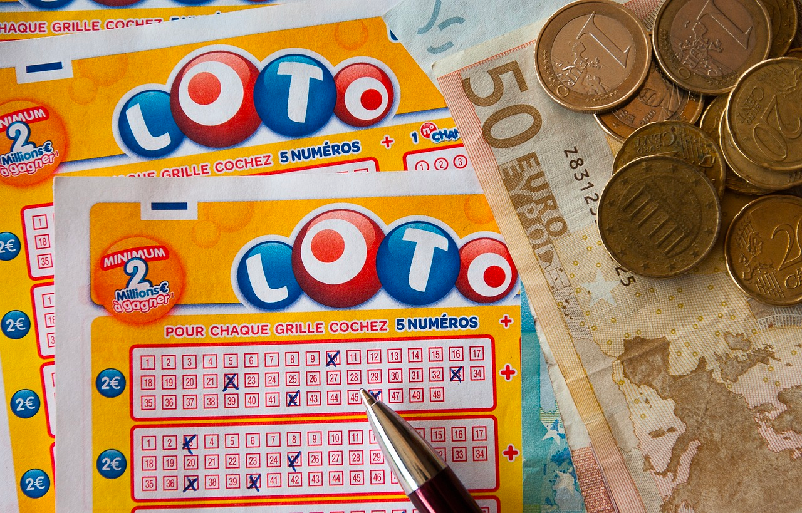

# 로또

  

## 소개

이 프로젝트는 사용자가 로또 번호를 구입하고, 당첨 번호와 비교하여 당첨 여부와 당첨 금액을 계산하는 Kotlin 기반의 프로그램입니다.
> 이 프로젝트는 일반 로또와 다른 방식으로 동작합니다!

일반 로또는 모든 번호가 정확하게 일치해야 1등이지만, 이 프로젝트의 로또는 당첨 번호를 가지고만 있어도 당첨으로 인정됩니다. 예를 들어, 당첨 번호가 (1, 2, 3, 4, 5, 6)이고 사용자의 로또 번호가 (
2, 3, 4, 5, 6, 7)라면 이 로또는 2등으로 인정됩니다.

## 기능 목록

- **구매 금액 설정**: 사용자는 원하는 구매 금액을 설정할 수 있으며, 1장의 로또 티켓은 1,000원에 구입됩니다.

- **로또 발행**: 설정한 구매 금액에 해당하는 만큼 로또를 자동으로 발행합니다.
    - 로또 번호는 1부터 45까지의 숫자 중 6개를 랜덤으로 선택합니다.
    - 로또 번호는 중복되지 않으며 오름차순으로 정렬됩니다.

- **로또 번호 비교**: 로또 번호가 같으면 동일한 로또 티켓으로 인식하며, 로또 번호를 가지고 있는지 확인할 수 있습니다.

- **당첨 번호 설정**: 사용자가 당첨 번호와 보너스 번호를 입력합니다.

- **당첨 확인**: 당첨 번호를 입력하면 로또 번호와 비교하여 당첨 내역을 계산합니다.
    - 로또 티켓의 랭킹을 매기고, 일치하는 번호의 개수를 세어 다음과 같은 당첨 금액을 계산합니다:
        - 1등: 6개 번호 일치 / 2,000,000,000원
        - 2등: 5개 번호 + 보너스 번호 일치 / 30,000,000원
        - 3등: 5개 번호 일치 / 1,500,000원
        - 4등: 4개 번호 일치 / 50,000원
        - 5등: 3개 번호 일치 / 5,000원

- **수익률 계산**: 합산한 당첨 금액과 구입 금액을 비교하여 수익률을 계산하고 소수점 둘째 자리에서 반올림합니다.

## 프로그램 예시

```
구입금액을 입력해 주세요.
8000

8개를 구매했습니다.
[8, 21, 23, 41, 42, 43] 
[3, 5, 11, 16, 32, 38] 
[7, 11, 16, 35, 36, 44] 
[1, 8, 11, 31, 41, 42] 
[13, 14, 16, 38, 42, 45] 
[7, 11, 30, 40, 42, 43] 
[2, 13, 22, 32, 38, 45] 
[1, 3, 5, 14, 22, 45]

당첨 번호를 입력해 주세요.
1,2,3,4,5,6

보너스 번호를 입력해 주세요.
7

당첨 통계
---
3개 일치 (5,000원) - 1개
4개 일치 (50,000원) - 0개
5개 일치 (1,500,000원) - 0개
5개 일치, 보너스 볼 일치 (30,000,000원) - 0개
6개 일치 (2,000,000,000원) - 0개
총 수익률은 62.5%입니다.
```

## 예외 상황 처리

사용자의 입력값이 잘못된 경우 "[ERROR]"로 시작하는 에러 메시지를 출력, 에러가 발생한 부분부터 다시 시작합니다.
다음과 같은 경우 사용자 입력 에러(IllegalArgumentException)가 발생합니다.

- 구입 금액 입력
    - 구입 금액이 1,000원 단위가 아닐 경우
    - 구입 금액이 숫자가 아닐 경우
- 당첨 번호 입력
    - 당첨 번호가 ,로 구분되지 않을 경우
    - `,` 로 구분된 당첨 번호가 숫자가 아닐 경우
    - 당첨 번호의 크기가 6개가 아닐 경우
    - 당첨 번호가 1 ~ 45 범위가 아닐 경우
    - 당첨 번호가 중복될 경우
- 보너스 번호 입력
    - 보너스 번호가 숫자가 아닐 경우
    - 보너스 번호가 1 ~ 45 범위가 아닐 경우
    - 보너스 번호가 당첨 번호와 중복될 경우

# 프로젝트 기능 명세서

## 기능 목록

- [x] : 구매 금액을 정한다.
    - [x] : 로또 1장의 가격은 1,000원이다.
- [x] : 로또 구입 금액을 입력하면 구입 금액에 해당하는 만큼 로또를 발행한다.
    - [x] : 로또 1장의 번호는 1 ~ 45까지의 숫자이다.
    - [x] : 로또 1장의 번호는 6개이다.
    - [x] : 로또 1장의 번호는 중복되지 않는다.
    - [x] : 로또 1장의 번호는 오름차순으로 정렬되어 있다.
- [x] 로또 번호가 같으면 같은 동일한 로또 티켓이다
- [x] 로또는 로또 번호를 가지고 있는지 확인할 수 있다.
- [x] 로또는 다른 로또와 일치하는 번호의 개수를 구할 수 있다.
- [x] : 당첨 로또 번호들을 발급 한다.
    - [x] : 당첨 번호 6개 발급
    - [x] : 보너스 번호 1개 발급
- [x] : 로또들의 번호와 당첨 번호를 비교하여 당첨 내역 계산 한다.
    - [x] : 로또 별 랭킹을 매긴다.
    - [x] : 각 랭킹별 몇 개의 번호가 있는지 센다.
    - [x] : 1등부터 5등까지의 당첨 금액을 계산한다.
        - 1등: 6개 번호 일치 / 2,000,000,000원
        - 2등: 5개 번호 + 보너스 번호 일치 / 30,000,000원
        - 3등: 5개 번호 일치 / 1,500,000원
        - 4등: 4개 번호 일치 / 50,000원
        - 5등: 3개 번호 일치 / 5,000원
- [x] : 합산한 당첨 금액과 구입 금액을 비교하여 수익률을 계산한다.
- [x] : 수익률은 소수점 둘째 자리에서 반올림한다.

## 예외 상황

- 예외 처리
    - [x] : "[ERROR]"로 시작하는 에러 메시지를 출력 후, Error 메시지를 출력한다.
    - [x] : 에러가 발생한 부분부터 다시 입력 받는다.
- 입력
    - [x] : 사용자가 잘못된 값을 입력할 경우 IllegalArgumentException를 발생
- 구입 금액
    - [x] : 구입 금액이 1,000원 단위가 아닐 경우
    - [x] : 구입 금액이 숫자가 아닐 경우
- 당첨 번호
    - [x] : 당첨 번호가 ,로 구분되지 않을 경우
    - [x] : ,로 구분된 당첨 번호가 숫자가 아닐 경우
    - [x] : 당첨 번호의 크기가 6개가 아닐 경우
    - [x] : 당첨 번호가 1 ~ 45 범위가 아닐 경우
    - [x] : 당첨 번호가 중복될 경우
- 보너스 번호
    - [x] : 보너스 번호가 숫자가 아닐 경우
    - [x] : 보너스 번호가 1 ~ 45 범위가 아닐 경우
    - [x] : 보너스 번호가 당첨 번호와 중복될 경우
- 로또 번호
    - [x] : 로또 번호의 크기가 6개가 아닐 경우
    - [x] : 로또 번호가 1 ~ 45 범위가 아닐 경우
    - [x] : 로또 번호가 중복될 경우