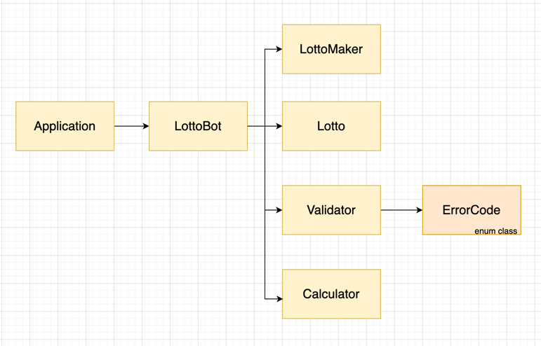

# 미션 - 로또

---

## 요구사항

### 입력 요구사항

- 로또 구입 금액을 입력받는다.
- 구입 금액은 1,000원 단위로 입력받으며 1,000원으로 나누어 떨어지지 않는 경우 예외 처리한다.
- 당첨 번호를 입력 받는다.
- 당첨 번호는 쉼표(,)를 기준으로 구분한다.
- 보너스 번호를 입력 받는다.
- 당첨 번호와 보너스 번호 범위는 1~45이다.

### 출력 요구사항

- 발행한 로또 수량 및 번호를 출력한다.
- 로또 번호는 오름차순으로 정렬하여 보여준다.

---

## 기능 명세

### LottoBot

- 구매금액 입력 형식이 올바를 때까지 입력받기를 진행한다.
-
- 구매금액을 기반으로 로또를 구입한다.
- 구입한 로또목록을 공개한다.
- 당첨 통계를 공개한다.

### LottoMaker

- 1~45 사이의 숫자를 6개 뽑아 정렬 후 반환한다.(로또 번호)
- 1~45 사이의 숫자를 1개 뽑아 반환한다. (보너스 볼 번호)

### Lotto

- 1~45 숫자 6개로 이루어진 상태이다.
- 로또 번호가 1~45사이의 6자리가 아닌 경우 IllegalArgumentException이 발생한다.

### Validator

- 구입 금액의 유효성을 검사한다.
- 당첨 번호의 유효성을 검사한다.
- 보너스 번호의 유효성을 검사한다.
- 배열에 중복되는 숫자가 없는지 검사하고 아닐 경우 예외처리와 문구를 출력한다.
- 입력받은 문자열을 쉼표(,) 기준으로 구분해 당첨번호로 매핑한다.
- 문자를 숫자로 변환하고 못하면 예외처리와 문구를 출력한다.
- 숫자가 1~45 범위인지 확인하고 범위 밖일 경우 예외처리와 문구를 출력한다.
- 1000원 단위로 떨어지는지 검사하고 아닐 경우 예외처리와 문구를 출력한다.
- 배열 사이즈가 6인지 확인하고 아닐 경우 예외처리와 문구를 출력한다.

### Calculator

- 총 수익률을 계산한다.
- 구입한 로또와 당첨 번호를 비교해 3,4,5,5와 보너스볼, 6개 당첨 결과를 파악한다.
- 당첨번호와 로또번호간 일치하는 숫자개수를 센다.
- 당첨 결과를 보여준다.
- 총 수익률을 보여준다.
- 개수 별(3,4,5,5와 보너스볼, 6개) 당첨여부를 판단한다.

### ErrorCode

- 입출력 시 발생할 수 있는 오류 프로퍼티를 가진다.
- 1~45 범위를 벗어난 숫자가 있을 경우
- 공백 또는 문자열 등의 숫자가 아닌 경우
- 1000원 단위가 아닌 경우
- 숫자 6개가 입력이 안된 경우
- 중복되는 숫자가 있는 경우

---

## 클래스 의존관계

