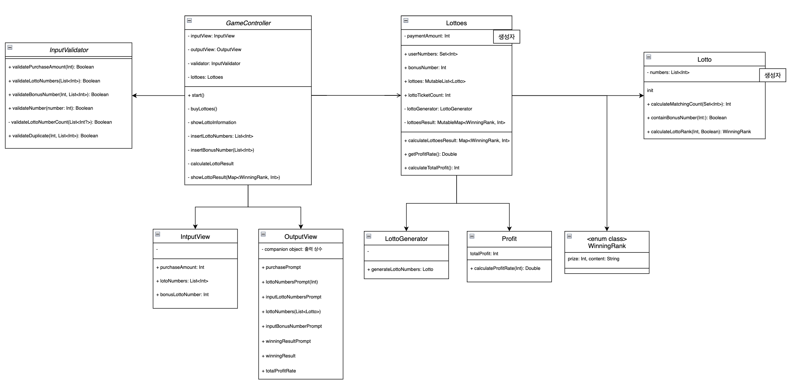

# 미션 - 로또

# 구현할 기능 목록

### 비즈니스 로직

- [x] 로또 수량을 계산한다.구입할 금액이 10,000 원이면 10 개이다. (`Lottoes` 의 `lottoTicketCount` 속성)

- [x] 6자리 로또번호를 생성한다. (`LottoGenerator.generateLottoNumbers`)
    - [x] 로또 번호는 오름차순으로 정렬된다.

- [x] 로또 번호의 조건(로또 번호 생성, 6자리 당첨번호 입력, 보너스 번호 입력시 만족해야 함) (`Lotto.init`)
    - [x] 로또 번호의 숫자 범위는 1 ~ 45 이다.
    - [x] 로또 번호는 중복되지 않는다.

- [x] 당첨 기준. enum class 로 구현하면 될 것 같음.  (`WinningRank`)
    - 당첨은 1등부터 5등까지 있다. 당첨 기준과 금액은 아래와 같다.
        - 1등: 6개 번호 일치 / 2,000,000,000원
        - 2등: 5개 번호 + 보너스 번호 일치 / 30,000,000원
        - 3등: 5개 번호 일치 / 1,500,000원
        - 4등: 4개 번호 일치 / 50,000원
        - 5등: 3개 번호 일치 / 5,000원

- [x] 당첨 기준에 따라 당첨 내역을 계산한다.
    - [x] 입력 번호와, 로또 번호를 비교해서 같은 숫자 개수를 계산한다. (`Lotto.calculateMathingCount`)
    - [x] 로또 번호 중에 보너스 번호가 있는지 판단한다. (`Lotto.containBonusNumber`)
    - [x] 한 로또가 몇 등인지 판단한다. (`Lotto.calculateLottoRank`)
    - [x] 총 로또 당첨 결과를 계산한다. (`Lottoes.calculateLottoesResult`)
    - [x] 총 로또 당첨 수익금을 계산한다. (`Lottoes.calculateTotalProfit`)


- [x] 총 수익률을 계산한다. (`Profit.calculateProfitRate`)
    - [x] 총 수익률은 소수점 둘째 자리에서 반올림한다. ex. 100.0%, 1,000,000.0%

### 입출력

- [x] 구입할 금액을 입력받는다.
    - [x] 구입할 금액을 입력하라는 안내 메시지를 출력한다. (`OutputView.purchasePrompt`)
  ```
  구입 금액을 입력해주세요.
  ```
    - [x] 사용자가 구입할 금액을 입력한다. (`InputView.purchaseAmount`)

- [x] 구입한 로또에 대한 정보를 출력한다.
    - [x] 발행한 로또 수량을 가지고 안내 메시지를 출력한다. (`OutputuView.lottoQuantityPrompt`)
  ```
  10개를 구매했습니다.
  ```
    - [x] 발행한 로또 번호를 출력한다. (`OutputView.lottoNumbers`)
  ```
  [8, 21, 23, 41, 42, 43]
  [3, 5, 11, 16, 32, 38]
  [7, 11, 16, 35, 36, 44]
  [1, 8, 11, 31, 41, 42]
  [13, 14, 16, 38, 42, 45]
  [7, 11, 30, 40, 42, 43]
  [2, 13, 22, 32, 38, 45]
  [1, 3, 5, 14, 22, 45]
  ```

- [x] 당첨 번호 입력 안내 메시지를 출력한다. (`OutputView.inputlottoNumbersPrompt`)
  ```
  당첨 번호를 입력해주세요.
  ```

- [x] 6자리 당첨 번호를 입력받는다. (`InputView.lottoNumbers`)
    - [x] 당첨 번호는 쉼표를 기준으로 구분한다.

- [x] 보너스 번호를 입력받는다. (`Inputview.bonusLottoNumber`)
    - [x] 보너스 번호 입력 안내 메시지를 출력한다. (`OutputView.inputBonusNumberPrompt`)

- [x] 당첨 통계
    - [x] 당첨 통계 안내 메시지를 출력한다. (`OutputView.winningResultPrompt`)
      ```
      당첨 통계
      ---
      ```
    - [x] 당첨 내역을 가지고 당첨 통계를 출력한다. (`OutputView.winningResult`)

- [x] 총 수익률을 출력한다. (`OutputView.totalProfitRate`)
  ```
  총 수익률은 62.5%입니다.
  ```

### 입력에 대한 유효성 검증

- [x] 구입할 금액은 자연수이며, 1000원 단위이다. (`InputValidator.validatePurchaseAmount`)
- [x] 로또 번호는 1 ~ 45 여야 한다. (`InputValidator.validateNumber`)
- [x] 로또 번호는 6자리이다. (`InputValidator.validateLottoNumberCount`)
- [x] 보너스 번호는 기존 로또 번호와 중복이 없어야 한다. (`InputValidator.validateDuplicate`)

## 코딩 전 UML 작성


## 중간 UML 수정


## 최종 UML
